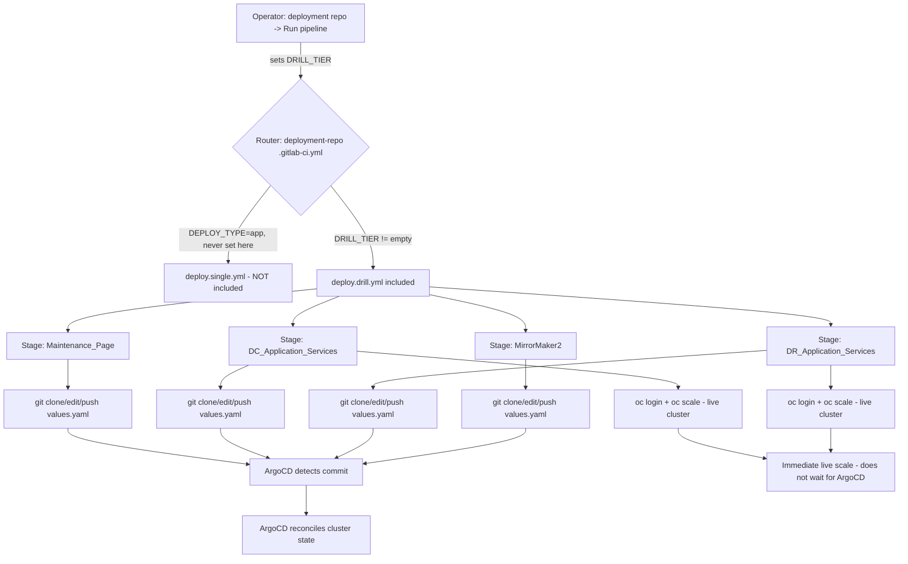

# Architecture

## The two layers

The drill pipeline is built from two layers that must both be understood — the routing layer that decides *whether* the drill logic even loads, and the orchestrator layer that defines *what* runs once it has.

### Layer 1 — the router (`deployment` repo's `.gitlab-ci.yml`)

The `deployment` repo's root `.gitlab-ci.yml` does not define any jobs itself. It conditionally includes one of three templates based on which variable is set, using GitLab's `include: rules:` mechanism (a rule attached directly to an `include:` entry, evaluated before any job is created):

```yaml
include:
  # Use Case 1: App service deployment
  - project: 'itepaypg-sbiepay2/infra/devops/cicd-templates'
    file: 'templates/cd/deploy.single.yml'
    rules:
      - if: '$CI_PIPELINE_SOURCE == "pipeline" && $DEPLOY_TYPE == "app"'

  # Use Case 2: Config-only deployment (commented out in the current file)
  # rules:
  #   - if: '$CI_PIPELINE_SOURCE == "pipeline" && $DEPLOY_TYPE == "config"'

  # Use Case 3: DC/DR Drill
  - project: 'itepaypg-sbiepay2/infra/devops/cicd-templates'
    file: 'templates/cd/deploy.drill.yml'
    rules:
      - if: '$DRILL_TIER != ""'
```

This is what makes the drill safe to coexist with normal deployments in the same repo:

- A normal app deployment is triggered by an app repo's CI pipeline via `ci/deploy/trigger.cd.yml`, which sets `DEPLOY_TYPE=app` and fires a **multi-project trigger** — so `CI_PIPELINE_SOURCE` is `"pipeline"`. That pipeline never sets `DRILL_TIER`, so the drill include's rule (`$DRILL_TIER != ""`) never matches. **A normal deploy can never accidentally run drill jobs.**
- The drill is started by a human manually running a pipeline in the `deployment` repo's UI and setting `DRILL_TIER`. That pipeline is *not* triggered by another project, so `CI_PIPELINE_SOURCE` is `"web"`, not `"pipeline"` — the app-deploy include's rule never matches. **A drill run can never accidentally trigger an app deployment.**

The two use cases are mutually exclusive by construction, not by convention — they key off different variables that are never set by the same trigger path.

### Layer 2 — the orchestrator (`templates/cd/deploy.drill.yml`)

Once the router decides `DRILL_TIER != ""`, it includes `deploy.drill.yml`, which:

- declares the four pipeline stages, in operational order
- declares shared variables (the deployment repo URL, the token to use, the chart names)
- includes the three job files: `drill.maintenance.yml`, `drill.scale.yml`, `drill.mirrormaker2.yml`

None of the actual job logic lives in `deploy.drill.yml` itself — it is purely a stage-and-include manifest.

```
stages:
  - Maintenance_Page
  - DC_Application_Services
  - DR_Application_Services
  - MirrorMaker2
```

Every job in every included file declares which stage it belongs to and is gated by a `rules: - if: '$DRILL_TIER == "..."'` check, so **only the jobs matching the tier you set are ever created** — a `prod` run never shows a `preprod` button and vice versa.

---

## The GitOps mechanism, in detail

All three job files (maintenance, scale, mirrormaker2) follow the same pattern for the git-side of the change:

1. `git clone` the `deployment` repo using `GITLAB_CI_DEPLOY_TOKEN` embedded in the clone URL.
2. `git checkout main` (the value of `$DEPLOYMENT_BRANCH`).
3. Edit one or more `values.yaml` files in place with `sed` (maintenance, scale) or `awk` (mirrormaker2) — never a full YAML parse/rewrite, so formatting and comments elsewhere in the file are preserved.
4. `git add`, then check `git diff --cached --quiet` — if nothing actually changed (already at the target state), skip the commit and push entirely.
5. `git commit` with a message in the form `drill(<env>): <what changed>`.
6. `git push origin main`, with up to 3 retries. On failure, `git pull --rebase origin main` before retrying — this handles the case where another job (or another operator) pushed a change to a *different* file in the same window.
7. ArgoCD, watching the `deployment` repo, detects the new commit and reconciles the affected Helm release onto the cluster.

**The scale jobs (`drill.scale.yml`) add a second step that the other two job files do not have:** after the GitOps push, they `oc login` directly to the target cluster and run `oc scale deployment/<name> --replicas=<n>` for every deployment in the target namespace map. This makes the scale operation take effect immediately, rather than waiting for ArgoCD's next sync cycle. Maintenance-page toggling and MirrorMaker2 toggling are GitOps-only — they rely entirely on ArgoCD to apply the change.

---

## Flow diagram



---

## Why the stages are ordered the way they are

`Maintenance_Page → DC_Application_Services → DR_Application_Services → MirrorMaker2`

This order exists so an operator can see the previous stage's jobs finish before deciding to proceed to the next — GitLab renders each stage as a distinct column, and jobs in a later stage cannot start until every job in the previous stage (that ran) has finished. Concretely, for a switchover:

1. Put the maintenance page up on **both** DC and DR first, so no user traffic is mid-flight when you start moving replicas.
2. Scale DC down. Confirm it went cleanly before touching DR.
3. Scale DR up. Traffic now has somewhere to land.
4. Only now flip MirrorMaker2 direction — reversing replication while both sides were still fully live would risk a split-brain window.

The switchback runbook reverses this sequence for the same reason, in reverse.
